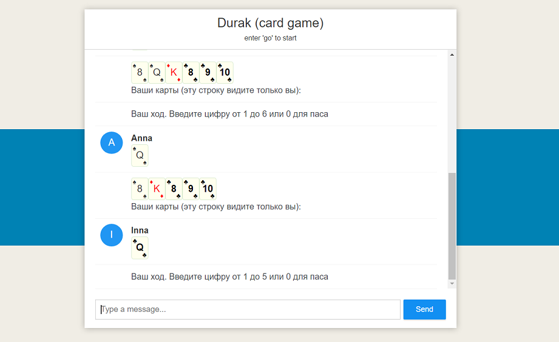

### Реализация карточной игры 'Дурак' в виде чата с использованием WebSocket
***
[Описание и правила игры на вики](https://ru.wikipedia.org/wiki/Дурак_(карточная_игра))

[Посмотреть на heroku](http://f00l.herokuapp.com/)

***
#### Особенности реализации

* version 1.0.0
    * игра против компьютера пока не поддерживается;
    * для начала игры нужно дождаться других игроков (или открыть еще одну вкладку браузера) и ввести 'go' в качестве сообщения;
    * ход осуществляется отправкой порядкового номера карты или 0;
    * ходить одновременно с нескольких карт нельзя, только по одной; но можно подряд;
    * нет возможности 'переводить' ход на следующего игрока.
